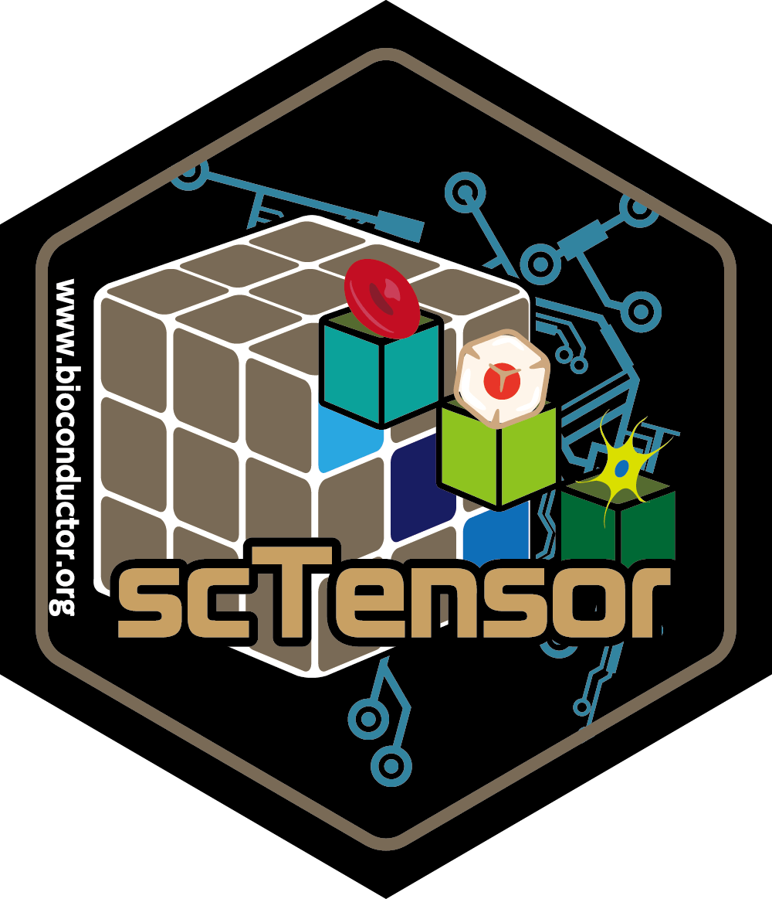

# scTensorWorkshop

# Workshop Description

# Participation

# R packages used
The following R packages will be used:

- SingleCellExperiment (Bioconductor)
- AnnotationHub (Bioconductor)
- LRBaseDbi (Bioconductor)
- scTensor (Bioconductor)
- einsum (CRAN)
- rTensor (CRAN)
- nnTensor (CRAN)
- HDF5Array (Bioconductor)
- DelayedArray (Bioconductor)
- DelayedTensor (Bioconductor)
- mwTensor (CRAN)

# Time outline

# Workshop goals and objectives

