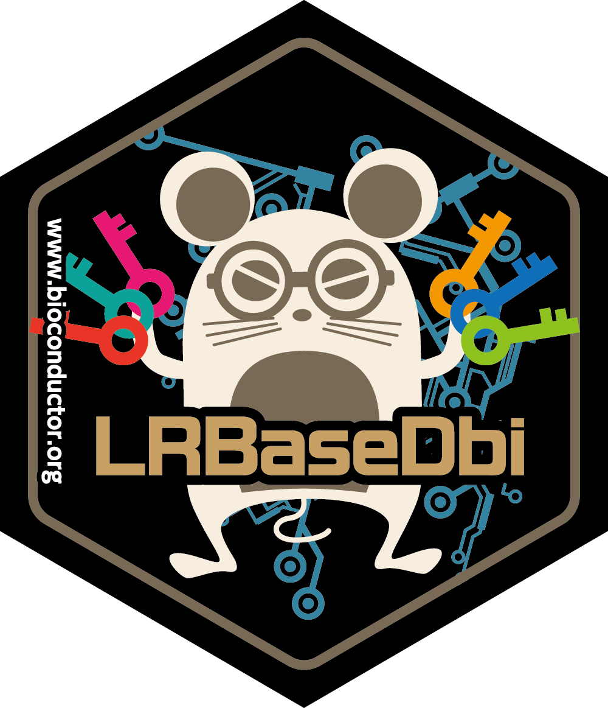
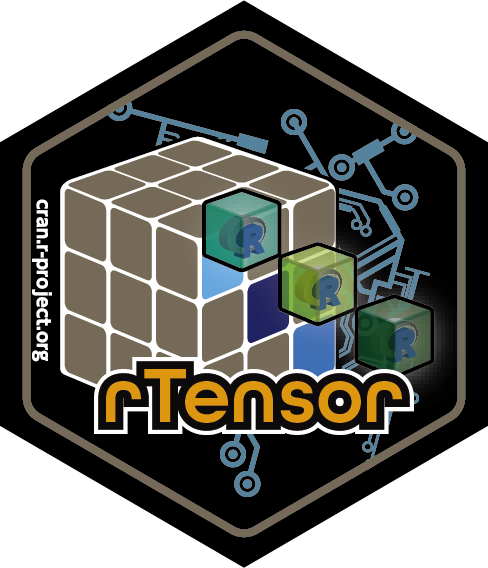
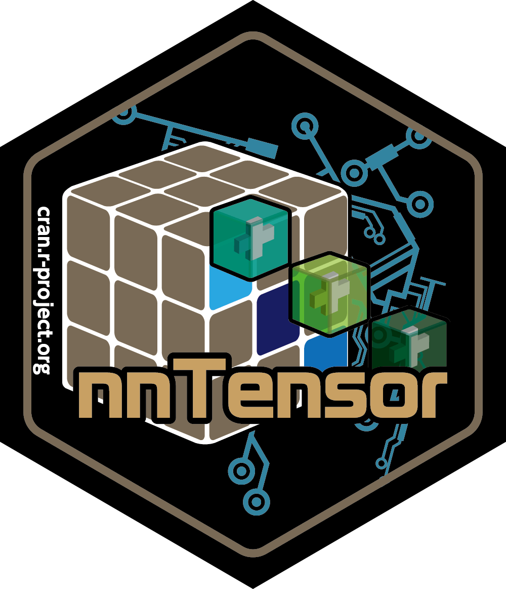
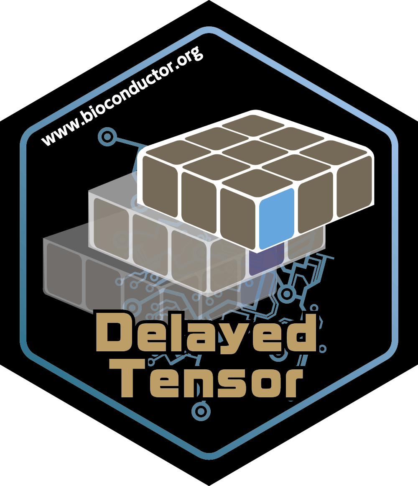
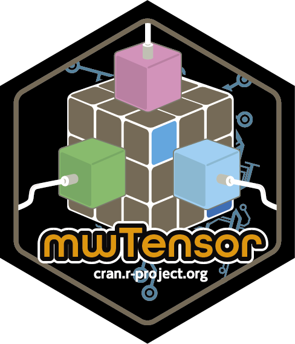

```{r knitr, include = FALSE}
knitr::opts_chunk$set(
  collapse = TRUE,
  comment = "#>",
  warning = FALSE,
  message = FALSE,
  fig.height = 7,
  fig.width = 10
)
options(knitr.duplicate.label = "allow")
```







## Description

In this workshop (presented in Japanese), you will learn how to detect cell-cell interaction from single-cell RNA-sequencing (scRNA-Seq) data using `scTensor` package. Moreover, you will learn some tensor frameworks of R language and will be able to freely use and decompose your original tensor data.

Expectation: In the first half, you will learn how to use `SingleCellExperiment` object, transform the scRNA-Seq data to higher-order tensor, and apply `scTensor` against it. In the latter half, you will learn some tensor-related R packages.

Pre-requisites: The course is aimed at PhD students, Master’s students, and third & fourth year undergraduate students. Some basic R knowledge is assumed - this is not an introduction to R course. If you are not familiar with the R statistical programming language it is compulsory that you work through an introductory R course before you attend this workshop.

## Participation

After the lecture, participants are expected to follow along the hands-on session. we highly recommend participants bringing your own laptop.

### _R_ / _Bioconductor_ / _CRAN_ packages used

The following R/Bioconductor packages will be explicitly used:

List any _R_ / _Bioconductor_ / _CRAN_ packages that will be explicitly covered.

* SingleCellExperiment (Bioconductor)
* AnnotationHub (Bioconductor)
* LRBaseDbi (Bioconductor)
* scTensor (Bioconductor)
* einsum (CRAN)
* rTensor (CRAN)
* nnTensor (CRAN)
* HDF5Array (Bioconductor)
* DelayedArray (Bioconductor)
* DelayedTensor (Bioconductor)
* mwTensor (CRAN)

## Time outline

| Activity                                                  | Time|
|-----------------------------------------------------------|-----|
| Cell-cell Interaction Analysis by scTensor                | 20m |
| Advanced Topics about Tensor Arithmetic and Decomposition | 30m |
| Q & A                                                     | 10m |

## Cell-cell Interaction Analysis by scTensor
### scTensor

In this workshop, we will use the following data pre-prepared in the `scTensor` package.

```{r sctensor}
library("scTensor")

data(GermMale) # Matrix (242 genes x 852 cells)
data(labelGermMale) # Vector (852 cells)
data(tsneGermMale) # Output object of Rtsne (852 cells x 2 coordinates)
```

`scTensor` assumes that the row names in the expression level matrix are NCBI Gene IDs. If you use a different type of Gene ID (Ensembl ID, Gencode ID, Symbol ...etc.), please convert them to NCBI Gene IDs according to the following document. [Roadmap to prepare the input matrix for scTensor](
https://www.bioconductor.org/packages/release/bioc/vignettes/scTensor/inst/doc/scTensor_1_Data_format_ID_Conversion.html)

### SingleCellExperiment

First, we will convert `GermMale` to a `SingleCellExperiment` object.

```{r sce}
library("SingleCellExperiment")

sce <- SingleCellExperiment(assays=list(counts = GermMale))
```

The coordinates of t-SNE are assigned in the `SingleCellExperiment` object using the `reducedDims` function. This information will be used later in the report.

```{r readuceddims}
reducedDims(sce) <- SimpleList(TSNE=tsneGermMale$Y)
```

The following process is optional, but if you want to assign the normalized expression amount into the `SingleCellExperiment` object, you can use the `normcounts` function.

```{r normcounts}
CPMED <- function(input){
    libsize <- colSums(input)
    median(libsize) * t(t(input) / libsize)
}

normcounts(sce) <- log10(CPMED(counts(sce)) + 1)
```

### AnnotationHub

This is the new feature since BioC 3.13. In earlier versions of BioC, an annotation package (`LRBase.XXX.eg.db`) containing the ligand-receptor pair database (`LRBase`) was required in addition to the user's expression level matrix to perform scTensor.

Since BioC 3.13, these various annotation packages have been discontinued. Instead, the relevant data are placed on a remote server called `AnnotationHub`, and the policy has been changed so that the data are downloaded only when the user needs them.

The relevant data can be obtained as follows.

```{r annotationhub}
library("AnnotationHub")

ah <- AnnotationHub()
dbfile <- query(ah, c("LRBaseDb", c("Homo sapiens", "v002")))[[1]]
```

The downloaded file will be stored on the local machine as a cached file by the `BiocFileCache` mechanism, so that the next time the data is needed, the data will be retrieved from the cache instead of from the server.

### LRBaseDbi

`dbfile` is a string that indicates the path of the cache file (SQLite). By using `LRBaseDb`, this file can be converted into an `LRBaseDb` object and used in `scTensor`.

```{r lrbasedbi}
library("LRBaseDbi")

LRBase.Hsa.eg.db <- LRBaseDbi::LRBaseDb(dbfile)
```

### scTensor
#### Real dataset

For real single-cell RNA-Seq data, `scTensor` is executed as follows.
First, use the `cellCellSetting` function to assign the prepared `LRBaseDb` object above to the metadata of `SingleCellExperiment`.

```{r cellcellsetting}
cellCellSetting(sce, LRBase.Hsa.eg.db, names(labelGermMale))
str(metadata(sce))
```

In the following, we will use `cellCellRanks` for searching rank parameters that can reduce the reconstruction error to some extent.

```{r cellcellranks}
rks <- cellCellRanks(sce, assayNames="normcounts")
```

The `cellCellDecomp` function performs non-negative tensor decomposition (see below) to detect ternary relationships (ligand-expressing cell type $\times$ receptor-expressing cell type $\times$ ligand-receptor pair) in the data in a data-driven manner.

```{r cellcelldecomp}
set.seed(1234)
cellCellDecomp(sce, ranks=rks$selected, assayNames="normcounts")
```

The extracted ternary relations can be viewed in an HTML report using the `cellCellReport` function.

```{r cellcellreport}
tmpdir <- tempdir()
cellCellReport(sce, reducedDimNames="TSNE", out.dir=tmpdir,
    assayNames="normcounts",
    title="Cell-cell interaction within Germline_Male, GSE86146",
    author="Koki Tsuyuzaki", html.open=FALSE, upper=2,
    goenrich=TRUE, meshenrich=FALSE, reactomeenrich=FALSE,
    doenrich=FALSE, ncgenrich=FALSE, dgnenrich=FALSE)
list.files(tmpdir)
```

#### Simulation dataset

For quantitative benchmarking, `scTensor` also provides a simulator that generates simulation data. You can check or change settings such as the number of genes (`nGene`), the number of cells (`nCell`), and the mode of cell-cell interaction (`cciInfo`) using the `getParam` and `setParam` functions.

```{r cellcellsimulate}
params <- newCCSParams()
getParam(params, "nGene")
getParam(params, "nCell")
getParam(params, "cciInfo")
setParam(params, "nGene") <- 100
setParam(params, "nCell") <- c(10, 10, 10)
setParam(params, "cciInfo") <- list(
    nPair=50,
    CCI1=list(LPattern=c(1,0,0),
        RPattern=c(0,1,0),
        nGene=10, fc="E10"))

out_sim <- cellCellSimulate(params)
str(out_sim$input)
str(out_sim$LR)
geneL <- out_sim$LR[,"GENEID_L"]
geneR <- out_sim$LR[,"GENEID_R"]
L <- out_sim$input[geneL, ] # 50genes × 30cells
R <- out_sim$input[geneR, ] # 50genes × 30cells
```

In the next section, we will use these matrices of ligand and receptor gene expression levels (`L` and `R`).

## Advanced Topics

The following subsections are advanced topics for the software developers who want to develop the novel methodologies to detect CCI or who are interested in tensor decomposition.

The tools introduced in the following sections will be very useful for performing tensor decomposition in R in the future.

### einsum

Here I describes what is actually done inside `scTensor`.

After `L` (ligand) and `R` (receptor) are extracted from the gene expression matrix, the outer product is calculated and the result become a third-order tensor.

This process is easily calculated by `einsum` as follows.

```{r einsum}
library("einsum")

CCItensor <- einsum::einsum('ij,kj->ikj', L, R)
```

`einsum` is the sugar syntax for the `for` statement.

In other words, it does exactly the same thing as executing the following `for` statement as follows.

```{r for}
CCItensor2 <- array(0, dim=c(nrow(L), nrow(R), ncol(L)))
for(i in 1:nrow(L)){
    for(j in 1:ncol(L)){
        for(k in 1:nrow(R)){
            CCItensor2[i,k,j] <- L[i,j] * R[k,j]
        }
    }
}
identical(CCItensor, CCItensor2)
```

However, using `einsum`, the code become shorter and simpler. Besides, since `einsum` converts the R code into C++ code once and then executes it, it can be faster code.

Originally, `einsum` is implemented in `numpy` package of Python language and recently it is also implemented as an R/CRAN package.

In the process of combining multiple tensors into a single tensor, `einsum` is a very powerful tool and should be used.

For the details, check these documents of [einsum](https://const-ae.github.io/einsum/index.html).

### rTensor

Tensors are not just multidimensional arrays, because there are uniqu operations for tensors, such as matricizing, slice, and mode product, and such operations are not provided in the standard R array. By converting the array to a `Tensor` object set by the `rTensor` package, such operations can be performed.

```{r rtensor}
library("rTensor")

CCItensor <- as.tensor(CCItensor)
is(CCItensor)
str(CCItensor@data) # Array data
```

After the object conversion, for example, these operations can be performed.

```{r arithmetic}
rTensor::modeSum(CCItensor, m=1, drop=TRUE) # Summation in a mode
rTensor::cs_unfold(CCItensor, m=1) # Matricizing
rTensor::fnorm(CCItensor) # Frobenius Norm
```

In `rTensor` package, various tensor operations and decomposition algorithms are implemented. For the further details, check the [document](https://cran.r-project.org/web/packages/rTensor/rTensor.pdf).

### nnTensor

`nnTensor` is the engine of `scTensor`; this decomposes `CCItensor` into factor matrices to detect ternary relationships (ligand-expressing cell type $\times$ receptor-expressing cell type $\times$ ligand-receptor pair).

In `scTensor`, `NTD` function is used to perform non-negative Tucker decomposition.

```{r nntensor}
library("nnTensor")

out_nn <- nnTensor::NTD(CCItensor, algorithm="KL", rank=c(3,4,5), verbose=TRUE)
str(out_nn$A) # Factor matrices
str(out_nn$S) # Core tensor
```

In addition to `NTD`, various non-negative matrix and tensor decompositions are available in the `nnTensor` package. For the further details, check the [document](https://cran.r-project.org/web/packages/rTensor/rTensor.pdf).

### DelayedTensor

One disadvantage of tensors is that they tend to have a large data size. To compensate for this disadvantage, here I introduce `DelayedTensor` (to be released in BioC 3.14).

First, load the necessary related packages and configure them as follows.

```{r delayedtensor1}
library("HDF5Array")
library("DelayedArray")
library("DelayedTensor")

options(delayedtensor.sparse = FALSE) # Sparse mode off
options(delayedtensor.verbose = TRUE) # Verbose message on
setHDF5DumpCompressionLevel(level=9L) # No compression inside of HDF5 file
setHDF5DumpDir(tmpdir) # Pass to save the temporary HDF5 files
setAutoBlockSize(size=1E+7) # Data size loaded on the memory at once
```

After that, R standard matrix or array objects are converted to `DelayedArray` objects.

```{r delayedtensor2}
darr_L <- DelayedArray(L)
darr_R <- DelayedArray(R)
```

`DelayedArray` provides the __lazy evaluation__ that is computed when the data value is actually needed, and an __out-of-core__ implementation that sequentially puts only a defined block size into memory and uses it for computation.

The `DelayedTensor` package attaches tensor arithmetic and tensor decomposition functions to `DelayedArray`, just like the relationship between R standard array and `rTensor` package.

For example, the `einsum` described above for `DelayedTensor` can also be performed for `DelayedArray`.

```{r delayedtensor3}
darr_CCItensor <- DelayedTensor::einsum('ij,kj->ikj', darr_L, darr_R)
```

Also, various functions of `rTensor` have been re-implemented for `DelayedArray`.

```{r delayedtensor4}
DelayedTensor::modeSum(darr_CCItensor, m=1, drop=TRUE)
DelayedTensor::cs_unfold(darr_CCItensor, m=1)
DelayedTensor::fnorm(darr_CCItensor)
```

For the details, check the [document](https://www.bioconductor.org/packages/devel/bioc/html/DelayedTensor.html).

### mwTensor

Finally, I will introduce `mwTensor`, an R/CRAN package that decomposes multiple tensors simultaneously. Most of the tensor decomposition algorithms extract patterns (factor matrices) by unfolding tensors into matrices form and then applying matrix decomposition algorithms such as PCA, NMF, or ICA. In the case of algorithms that decompose multiple tensors simultaneously, it is assumed that there is a common factor matrix between them.

The role of `mwTensor` is to describe such complex modeling as a parameter object so that users do not have to implement tensor decomposition from scratch.

In the following, I will show an example of decomposition of three tensors simultaneously.

```{r mwtensor}
library("mwTensor")

Xs <- mwTensor::toyModel("coupled_CP_Easy")
params <- new("CoupledMWCAParams", Xs=Xs, verbose=TRUE)
out_mw <- CoupledMWCA(params)
str(out_mw@common_factors)
str(out_mw@common_cores)
```

## Session Information

```{r}
sessionInfo()
```
